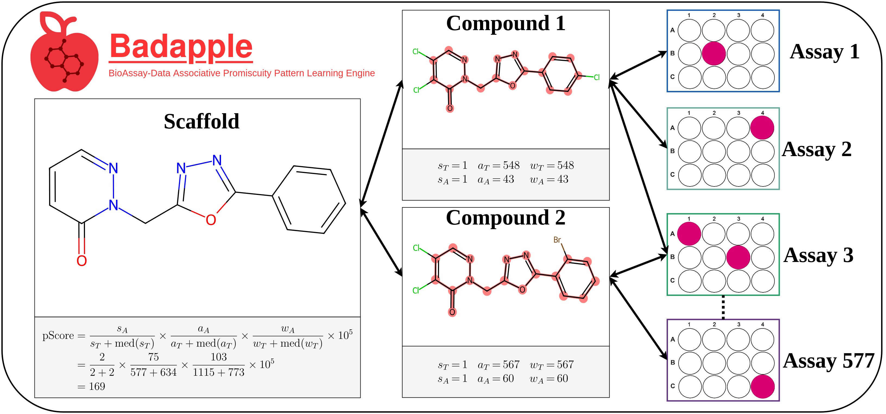

# Badapple2


Bioassay-Data Associative Promiscuity Pattern Learning Engine V2.

https://pubs.acs.org/doi/full/10.1021/acs.jcim.5c02297

## About

Badapple is a method for detecting likely promiscuous compounds via their associated scaffolds, using public bioassay data from [PubChem](https://pubchem.ncbi.nlm.nih.gov/).



For more information about Badapple please see the following papers:

- [Badapple 2.0: An Empirical Predictor of Compound Promiscuity, Updated, Modernized, and Enhanced for Explainability](https://pubs.acs.org/doi/full/10.1021/acs.jcim.5c02297)
- [Badapple: promiscuity patterns from noisy evidence](https://jcheminf.biomedcentral.com/articles/10.1186/s13321-016-0137-3)

The code contained in this repo is for building and analyzing the Badapple databases. If you would like to view the code for the Badapple UI or API please visit the repos below:

- API: https://github.com/unmtransinfo/Badapple2-API
- UI: https://github.com/unmtransinfo/Badapple2-UI

For small use cases (up to 100 compounds) one can use the Badapple2 web app: https://chiltepin.health.unm.edu/badapple2.

# Setup

If you would like to locally install everything (UI+API+DBs) you can clone the [Badapple2-API repo](https://github.com/unmtransinfo/Badapple2-API) and follow the [local installation instructions](https://github.com/unmtransinfo/Badapple2-API?tab=readme-ov-file#setup-local-installation).

If you would like to install just the DBs continue reading.

## badapple_classic

If you want to setup the badapple_classic DB follow the instructions [here](badapple1_comparison/README.md).

## badapple2

The steps below outline how one can setup the badapple2 DB.

### Easy Setup

#### Option 1: Docker

Use this option to install a Docker image with the DB.

See the docker README file [here](docker/README.md#badapple2)

#### Option 2: PostgreSQL

Use this option to install the DB directly on your system using PostgreSQL.

1. Follow the PostgreSQL setup instructions [here](#postgresql-setup)
2. Download [badapple2.pgdump](https://unmtid-dbs.net/download/Badapple2/badapple2.pgdump).
   - **Note:** If your use case needs the "activity" table, then instead download [badapple2_full.pgdump](https://unmtid-dbs.net/download/Badapple2/badapple2_full.pgdump)
3. Create the DB: `createdb badapple2`
4. Load DB from dump file: `pg_restore -O -x -v -d badapple2 badapple2.pgdump`
   - **Note:** If you're including the "activity" table then use: `pg_restore -O -x -v -d badapple2 badapple2_full.pgdump`

### Setup "from-scratch"

**You can skip this section if you setup the DB using the steps from above**

If you would like to run the entire workflow used to create the badapple2 DB, then please follow the instructions [here](snakemake/README.md).

## Code Usage

If you'd like to run the scripts/code contained within this repository then you will need to follow the setup guidelines outlined below.

### System Requirements

Code is expected to work on Linux systems.

MacOS and Windows users will need need to modify the conda [environment.yml](environment.yml) file. Make sure to follow appropriate installation guidelines for other dependencies (PostgreSQL, Docker). Please note that packages/dependencies may function differently across operating systems.

### Python Setup

1. Setup conda (see the [Miniconda Site](https://conda.github.io/conda-libmamba-solver/user-guide/) for more info)
   - (Optional) I'd recommend using the libmamba solver for faster install times, see [here](https://conda.github.io/conda-libmamba-solver/user-guide/)
2. Install the Badapple2 environment: `conda env create -f environment.yml`
   - This will create a new conda env with name `badapple2`. If you wish, you can change the first line of [environment.yml](environment.yml) prior to the command above to change the name.

### PostgreSQL Setup

1. Install PostgreSQL with the RDKit cartridge (requires sudo):
   `sudo apt install postgresql-14-rdkit`
2. (Option 1) Make your user a superuser prior to DB setup:
   1. Switch to postgres user: `(base) <username>@<computer>:~$ sudo -i -u postgres`
   2. Make yourself a superuser: `psql -c "CREATE ROLE <username> WITH SUPERUSER PASSWORD '<password>'"`
3. (Option 2) If you don't want to make `<username>` a superuser, follow the steps below:
   1. When running DB setup commands, prepend `sudo -u postgres` to DB setup commands. For example, instead of `createdb <DB_NAME>` use `sudo -u postgres createdb <DB_NAME>`.
   2. After setting up the DB as `postgres` you can grant permissions to `<username>` to access the DB as `<username>` like so:
   ```
   sudo -i -u postgres
   psql -d <DB_NAME> -c "CREATE ROLE <username> WITH LOGIN PASSWORD '<password>'"
   psql -d <DB_NAME> -c "GRANT SELECT ON ALL TABLES IN SCHEMA public TO <username>"
   psql -d <DB_NAME> -c "GRANT SELECT ON ALL SEQUENCES IN SCHEMA public TO <username>"
   psql -d <DB_NAME> -c "GRANT EXECUTE ON ALL FUNCTIONS IN SCHEMA public TO <username>"
   ```

## Results

Part of the development of Badapple 2.0 (badapple2DB) involved comparing/analyzing several different databases. The subsections below will point you towards notebooks and workflows used for all of the major analyses within this work.

### badapple vs badapple_classic

| Notebook Link                                                                                                                                  | Description                                                                                           |
| ---------------------------------------------------------------------------------------------------------------------------------------------- | ----------------------------------------------------------------------------------------------------- |
| [badapple1_comparison/src/notebooks/badapple-vs-badapple_classic.ipynb](badapple1_comparison/src/notebooks/badapple-vs-badapple_classic.ipynb) | Comparison of scaffold pScores (and other important statistics) between badapple and badapple_classic |

- Additional scripts used to compare badapple and badapple_classic databases can be found here: [badapple1_comparison/src/sql/](badapple1_comparison/src/sql/).

### badapple_classic vs badapple2

| Notebook Link                                                                                                            | Description                                                                                            |
| ------------------------------------------------------------------------------------------------------------------------ | ------------------------------------------------------------------------------------------------------ |
| [src/notebooks/badapple2-vs-badapple_classic.ipynb](src/notebooks/badapple2-vs-badapple_classic.ipynb)                   | Comparison of scaffold pScores (and other important statistics) between badapple2 and badapple_classic |
| [src/notebooks/badapple2-vs-classic_assay_annotations.ipynb](src/notebooks/badapple2-vs-classic_assay_annotations.ipynb) | Comparison of the assay annotations (from BARD) between badapple2 and badapple_classic/badapple        |
| [src/notebooks/badapple2-vs-classic_targets.ipynb](src/notebooks/badapple2-vs-classic_targets.ipynb)                     | A comparison of the biological targets in badapple2 and badapple_classic/badapple                      |

- Additional scripts used to compare badapple2 and badapple_classic databases can be found here: [src/sql/](src/sql/).

### badapple2 Additional Analyses

| Notebook Link                                                                            | Description                                                                                      |
| ---------------------------------------------------------------------------------------- | ------------------------------------------------------------------------------------------------ |
| [src/notebooks/target_pscore_analysis.ipynb](src/notebooks/target_pscore_analysis.ipynb) | Analyzing how pScores compare to number of unique protein targets for each scaffold in badapple2 |

### Other

| Notebook/Workflow Link                                                   | Description                                                                                                                                                                                   |
| ------------------------------------------------------------------------ | --------------------------------------------------------------------------------------------------------------------------------------------------------------------------------------------- |
| [src/notebooks/worked_example.ipynb](src/notebooks/worked_example.ipynb) | A notebook with a worked example illustrating how Badapple computes the pScore of a given scaffold                                                                                            |
| [snakemake/Snakefile_NATA](snakemake/Snakefile_NATA)                     | Snakemake workflow used to evaluate different thresholds of `nass_tested` when creating Badapple 2.0. This workflow was used to determine that a threshold of `nass_tested=50` is reasonable. |
| [snakemake/Snakefile](snakemake/Snakefile)                               | Snakemake workflow used to create Badapple 2.0 from scratch                                                                                                                                   |

## Citation

If you find Badapple useful please cite the our most recent paper:

```
@article{doi:10.1021/acs.jcim.5c02297,
         author = {Ringer, John A. and Lambert, Christophe G. and Bradfute, Steven B. and Bologa, Cristian G. and Yang, Jeremy J.},
         title = {Badapple 2.0: An Empirical Predictor of Compound Promiscuity, Updated, Modernized, and Enhanced for Explainability},
         journal = {Journal of Chemical Information and Modeling},
         volume = {0},
         number = {0},
         pages = {null},
         year = {0},
         doi = {10.1021/acs.jcim.5c02297},
         note = {PMID: 41235766},
         URL = {
                  https://doi.org/10.1021/acs.jcim.5c02297
         },
         eprint = {
                  https://doi.org/10.1021/acs.jcim.5c02297
         }
        }
```
